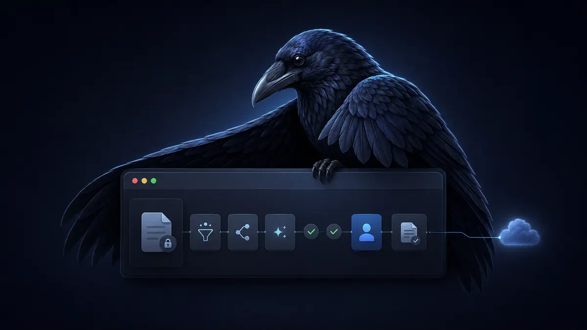

# OOMU

<p align="center">
  <strong>Trust, built in.</strong>
</p>

<p align="center">
  
</p>

<p align="center">
  <a href="https://oomu.ai/docs.html">Documentation</a>
  ·
  <a href="https://oomu.ai/docs-getting-started.html">First launch</a>
  ·
  <a href="https://oomu.ai/community.html#download">Community Edition</a>
</p>

## Of course this is how agents should work.

**Powerful AI agents. None of the burden.** OOMU runs your everyday work on your own Mac, asks for the cloud only when a task truly needs it, and shows you the plan before it acts.

Free. Source available. Community licensed. Built for Apple Silicon.

## AI that does the work around the decision

AI can finally read what you do not have time to read, sort the mess, draft the reply, and prepare the report. OOMU carries the technical complexity so the work you see stays calm, clear, and ready to use.

| What you see | What it means |
| --- | --- |
| **Visible workflows** | Build work from clear steps you can see, instead of prompts you have to perfect. |
| **Human review** | Review what OOMU will read, prepare, and ask before it runs. When an action matters, it asks first. |
| **Local where possible** | Routine work runs on your Mac. Private work stays close, and the cloud is used only through providers you configure. |
| **Clear records** | When work is finished, you can see exactly what happened. |
| **Mods** | Add a real capability in one contained `.oomu` file, from research across your documents to a workflow shaped around your work. |

## Four simple moves

1. **Choose the work.** Start with something you already understand: email replies, folder reviews, summaries, reports, or routines.
2. **Build the steps.** A workflow is a set of clear, visible steps.
3. **Review the plan.** Change anything before OOMU acts.
4. **Run it.** OOMU does the tedious work around your judgment, then shows you the result.

## Built for Apple Silicon

OOMU is a native macOS application for Apple Silicon Macs. It is designed as a single desktop application, not a cloud service: a React interface and Rust desktop engine are packaged together with Tauri. The engine runs local models, stores workspace data locally, applies file and permission boundaries, connects to cloud providers that you configure, and manages Mods.

The local engine is the default path for routine work. When a task genuinely calls for a cloud model, Auto-Route evaluates the message and follows your selected engine and Project policy. You can turn Auto-Route off and pin a conversation to a fixed engine at any time.

Read the [system design overview](https://oomu.ai/docs-system-design.html) for the architecture, the [privacy and sandboxing guide](https://oomu.ai/docs-privacy-sandboxing.html) for the trust boundary, and the [smart model routing guide](https://oomu.ai/docs-model-routing.html) for the local-and-cloud decision path.

## Use OOMU

The Community Edition is a full product, not a stripped-down demonstration. It is intended for individual builders and researchers who want a private, elegant AI workstation on their own Mac.

For installation, first launch, projects, custom assistants, connections, and Mods, start with the [official documentation](https://oomu.ai/docs.html). The [Community Edition page](https://oomu.ai/community.html#download) carries current download availability.

## Run from source

This repository is for macOS development. You need macOS 14 or later, an Apple Silicon Mac, Xcode command-line tools, Node.js 22.17.0 with npm 10.9.2, Rust 1.95.0 with the `aarch64-apple-darwin` target, CMake, LLVM, and Python 3.

```sh
npm ci
npm run tauri:dev
```

Use [`DEVELOPMENT_SETUP.md`](DEVELOPMENT_SETUP.md) for the complete prerequisite list, first-run testing, local helper preparation, validation commands, and protected-release details.

## Source and repository boundaries

- This repository contains source and development tooling. Generated dependencies, model weights, local application state, OAuth credential bundles, signing identities, notarization credentials, compiled applications, and release candidates are intentionally excluded.
- Production signing and notarization are protected local operations. They are not performed in GitHub Actions.
- OOMU does not accept external code contributions. GitHub Issues are the public channel for reproducible defects, product feedback, feature requests, and documentation corrections. See [`CONTRIBUTING.md`](CONTRIBUTING.md).
- Report a suspected vulnerability privately through the repository's GitHub Security Advisory page. Do not place credentials, private user data, or an exploitable proof of concept in a public issue. See [`SECURITY.md`](SECURITY.md).

## License

OOMU is source available under the [OOMU Community License](LICENSE.md). It is not an OSI-approved open-source license. The license permits eligible individual, noncommercial use only and places specific limits on modification and redistribution. Review it before using, modifying, or distributing the software.

© 2026 Eldris, Inc. OOMU® is a registered trademark of Eldris.
